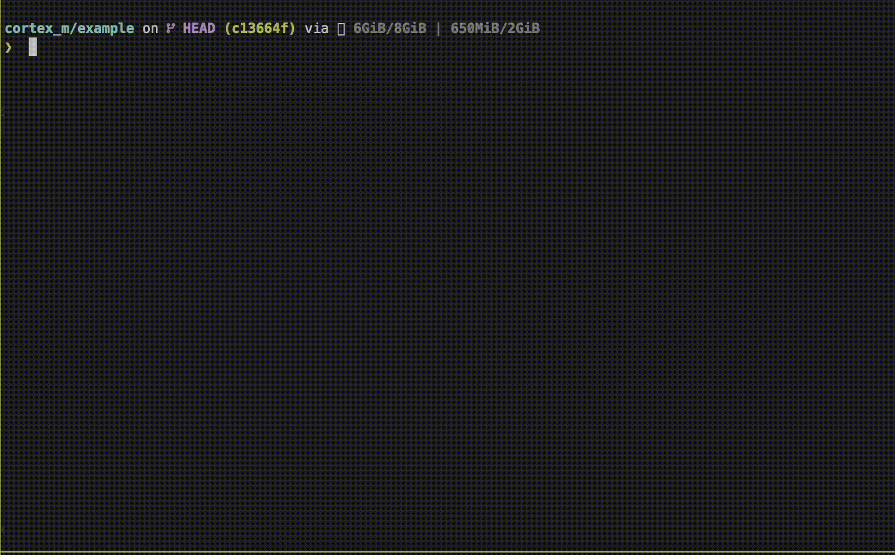

Tools for building and testing for Cortex-M with Bazel

<details><summary>gif</summary>



</details>

# building

An elf can be built for a target platform by specifying the platform

```sh
bazel build \
  --platforms=@cortex_m//platform:lm3s6965evb \
  <binary>
```

where `<binary>` is a `cc_binary` target.

Supported platforms provide generic startup code associated with the default
registered toolchain.

# running with `qemu`

An elf can be run with `qemu-system-arm`. This requires an installation of `nix`
to download the `qemu` package.

```sh
bazel run \
  --run_under=@cortex_m//:qemu_runner \
  --platforms=@cortex_m//platform:lm3s6965evb \
  <binary> -- <qemu-args>
```

By default, the QEMU runner sets the machine to match the target platform.
Additional arguments can be passed to `qemu-system-arm` after `--` (e.g., the
GDB connection or to freeze CPU at startup).

# enabling semihosting

By default, semihosting is not enabled when building targets. It can be enabled
with bool flag `--@cortex_m//config:semihosting`.

```sh
bazel run \
  --run_under=@cortex_m//:qemu_runner \
  --platforms=@cortex_m//platform:lm3s6965evb \
  --@cortex_m//config:semihosting \
  <binary>
```

# running tests with `qemu`

`cc_test` targets can be built for the target platform and run under emulation
with a CcTestRunner that uses `qemu-system-arm`. This runner is registered by
default. Note that `--@cortex_m//config:semihosting` must be passed so that elf
is built with semihosting enabled.

```sh
bazel test \
  --platforms=@cortex_m//platform:lm3s6965evb \
  --@cortex_m//config:semihosting \
  //...
```

# flagless builds

`transition_config_binary` and `transition_config_test` can be used to
transition a binary target to always enable or disable semihosting, set the
target platform, and specify extra toolchains.

```starlark
load(
    "@cortex_m//rules:transitions.bzl",
    "transition_config_binary",
    "transition_config_test",
)

transition_config_binary(
    name = "binary",
    src = ":_binary",
    semihosting = "enabled",
    platform = "@cortex_m//platform:lm3s6965evb",
)

transition_config_test(
    name = "test",
    src = ":_test",
    platform = "@cortex_m//platform:lm3s6965evb",
)
```
